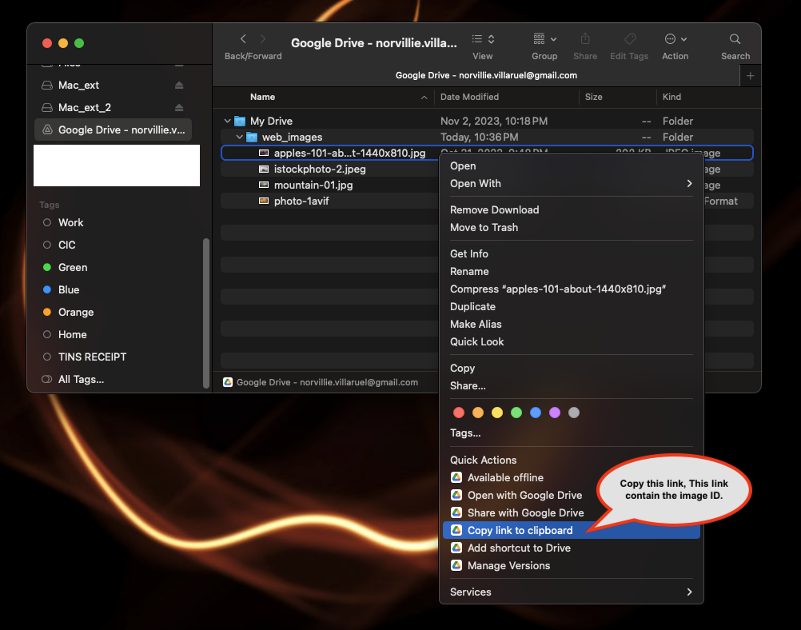

# Simple next/react.js app to demo how to use google drive as a image host.

### Steps necesary to enable google drive to host images for your web site.

- Step 1.
  - Link your google drive to your computer.
    
- Step 2.
  - Create a folder in your google drive, name it whatever you want.
    
- Step 3.
  - Make that folder public by setting general access to anyone with the link.
    
  - Setting General Access to Anyone with the Link.
    
- Step 4.
  - To use the image, copy to the clipboard, This image contain the id that you'll need to parse.
    
- Step 5.
  - Please check out my code how I parse/extract the id and how to display it on web.

 

---

 
Note: Please be advised that additional steps are required to render this images on the web. For further details, kindly refer to the code provided.
